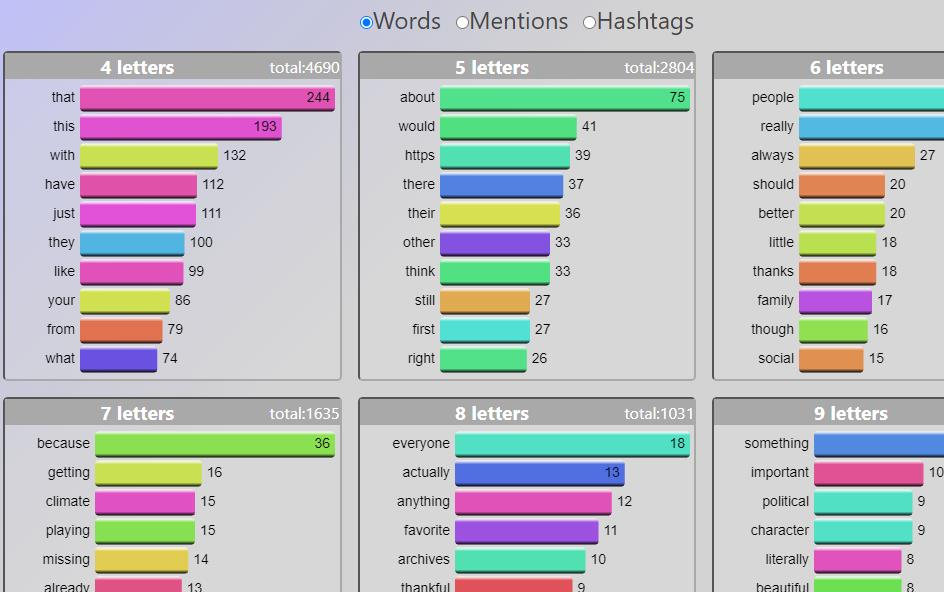

  

## SkeetScope: What?

Yet another random experiment with the BlueSky Firehose API.

Close on the heels of my previous effort at [Amerenglish](https://s4ag.com/amerenglish/)

This one is a standard tracker of word frequencies.

I do like the racing bar charts. They're kind of cool.

Inspired by (potentially NSFW) efforts such as:

* [ATmospheric Digital Rain](https://jakebailey.dev/bsky-digital-rain)
* [RainbowSky](https://www.bewitched.com/demo/rainbowsky)
* [EmojiRain](https://www.emojirain.lol)
* [Into the Bluesky](https://www.intothebluesky.lol)
* [Bluesky Visualizers](https://flo-bit.dev/bluesky-visualizers)
* [Firehose 3D](https://firehose3d.theo.io)
* [SwearSky](https://swearsky.bagpuss.org) (NSFW)
* [I am...](https://javier.computer/bluesky/iam)
* [Firesky](https://firesky.tv)
* [Bluesky Mosaic](https://lantto.github.io/bluesky-mosaic) (NSFW)
* [Bluesky Signups](https://bluesky.toddle.site/signups)

If you want to play with the code, [clone it](https://github.com/voneum/s4ag.skeetscope) on GitHub.

Feel free to submit patches!

## Online

* [SkeetScope](https://s4ag.com/SkeetScope/)

## Build

I use Typescript, VS Code, Vite, and Solid-JS.

The firehose relevant code is heavily influenced by (/borrowed from) [Jake Lazaroff](https://jakelazaroff.com/words/drinking-from-the-bluesky-firehose/)